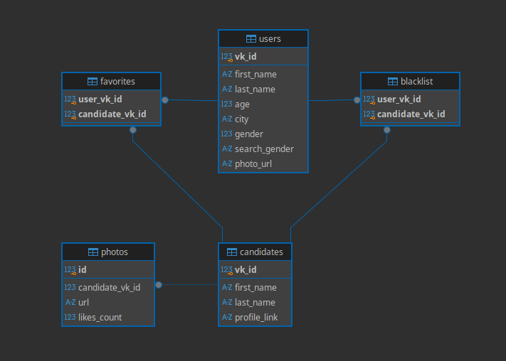

# 🐾 VKinder-App

[](https://www.python.org/)
[](https://www.postgresql.org/)
[](https://www.sqlalchemy.org/)
[](https://github.com/psf/black)
[](LICENSE)

Умный бот для знакомств ВКонтакте, который подбирает анкеты на основе возраста, пола и города пользователя, демонстрирует топ-3 фотографии по количеству лайков и предоставляет удобный интерфейс для управления симпатиями (избранное и черный список).

Проект разработан в рамках учебного курса по Python-разработке и демонстрирует навыки построения масштабируемой архитектуры, работы с реляционными базами данных через ORM и интеграции со сторонними API.

---

## 📑 Оглавление
- [✨ Ключевые особенности](#-ключевые-особенности)
- [🛠 Стек технологий](#-стек-технологий)
- [🗄 Архитектура базы данных](#-архитектура-базы-данных)
- [📂 Структура проекта](#-структура-проекта)
- [⚙️ Установка и запуск](#️-установка-и-запуск)
- [🤖 Руководство пользователя](#-руководство-пользователя)
- [🛡 Инженерные практики](#-инженерные-практики)
- [💡 Ключевые технические инсайты](#-ключевые-технические-инсайты)
- [👥 Авторы](#-авторы)

---

## ✨ Ключевые особенности
- **Умный подбор:** Фильтрация кандидатов по полу, возрасту и городу через VK API.
- **Рейтинг фото:** Автоматическая сортировка и вывод топ-3 фотографий кандидата на основе количества лайков.
- **Гибкое управление:** Возможность в любой момент изменить предпочтения поиска.
- **Черный список:** Надежная защита от повторного показа отклоненных анкет.
- **Отказоустойчивость:** Полная обработка ошибок базы данных с механизмом `rollback`.

---

## 🛠 Стек технологий
| Категория | Технологии |
| :--- | :--- |
| **Язык** | Python 3.10+ |
| **База данных** | PostgreSQL |
| **ORM** | SQLAlchemy 2.0 |
| **Внешние API** | VK API (`users.get`, `users.search`, `photos.get`) |
| **Библиотека бота** | `vk_api` |
| **Инструменты** | `python-dotenv`, `Black` (форматирование), `typing` (аннотации типов) |

---

## 🗄 Архитектура базы данных

Проект использует нормализованную реляционную модель. Для предотвращения дублирования данных в связях "многие-ко-многим" используются составные первичные ключи (Composite Primary Keys) и каскадное удаление (`ON DELETE CASCADE`).



База данных состоит из 5 основных сущностей:
- `users` — пользователи бота (хранит демографические данные, `search_gender` для предпочтений и `photo_url` аватарки).
- `candidates` — профили потенциальных партнеров для знакомств.
- `photos` — фотографии кандидатов с метрикой `likes_count` для сортировки.
- `favorites` — ассоциативная таблица избранных кандидатов.
- `blacklist` — ассоциативная таблица заблокированных пользователей.

> 📄 Полный SQL-скрипт для ручного развертывания схемы доступен в файле [db/create_tables.sql](db/create_tables.sql).

---

## 📂 Структура проекта

```text
VKinder-App/
├── db/                           # Модуль работы с базой данных
│   ├── __init__.py               # Инициализация пакета
│   ├── models.py                 # SQLAlchemy модели (декларативный стиль)
│   ├── database.py               # Конфигурация Engine, SessionMaker и инициализация БД
│   ├── crud.py                   # Типизированные CRUD-операции с обработкой исключений
│   └── create_tables.sql         # SQL-скрипт для создания таблиц и индексов
├── docs/                         # Документация проекта
│   └── ER_diagram.png            # Визуальная ER-диаграмма структуры БД
├── vk_bot/                       # Модуль взаимодействия с VK API и логика бота
│   ├── __init__.py               # Инициализация пакета
│   ├── vk_get_info_photo_user.py # Функции получения данных/фото из VK API и точка запуска бота
│   ├── keyboard.json             # Конфигурация основной клавиатуры бота
│   └── keyboard_like.json        # Конфигурация клавиатуры для взаимодействия с анкетой (лайк/дизлайк)
├── .env.example                  # Шаблон переменных окружения
├── .gitignore                    # Исключения для системы контроля версий
├── main.py                       # Точка входа в приложение: инициализация БД и старт бота
└── requirements.txt              # Зависимости проекта (включая `vk_api`, `SQLAlchemy`, `Black`)
```


---

## ⚙️ Установка и запуск

Следуйте этим инструкциям для развертывания проекта в локальном окружении.

1. **Клонируйте репозиторий:**
    ```bash
    git clone https://github.com/ambal333/VKinder-App.git
    cd VKinder-App
    ```
2. **Создайте и активируйте виртуальное окружение:**
    ```bash
    python -m venv venv
    source venv/bin/activate  # Для Windows: venv\Scripts\activate
    ```
3. **Установите зависимости:**
    ```bash
    pip install -r requirements.txt
    ```
4. **Настройте переменные окружения:**   
    - Скопируйте шаблон: `cp .env.example .env` (или `copy .env.example .env` в Windows).
    - Откройте файл `.env` и заполните его реальными данными:
    ```env
    # Параметры подключения к PostgreSQL
    DB_HOST=localhost
    DB_PORT=5432
    DB_NAME=vkinder_db
    DB_USER=postgres
    DB_PASSWORD=your_secure_password

    # Токены VK API
    VK_BOT_TOKEN=your_group_token_here
    VK_USER_TOKEN=your_user_token_here
    ```
5. **Запустите приложение:**
    ```bash
    python main.py
    ```
    _При запуске скрипт автоматически проверит наличие всех переменных окружения. Если таблицы в БД отсутствуют, они будут созданы автоматически благодаря вызову `Base.metadata.create_all()`._

---

## 🤖 Руководство пользователя

1. Найдите бота в ВКонтакте и нажмите кнопку «Запустить» (`/start`).
2. Бот запросит или подтвердит ваши данные.
3. Нажмите кнопку «Найти пару», чтобы получить первую анкету.
4. Используйте интерактивные кнопки под анкетой:
    - ❤️ Лайк — добавить кандидата в избранное.
    - 👎 Дизлайк — добавить кандидата в черный список (анкета больше не будет показываться).
    - ➡️ Дальше — перейти к следующей анкете.
5. В любой момент нажмите кнопку «Мои симпатии», чтобы вывести список всех пользователей, которых вы отметили лайком.

---

## 🛡 Инженерные практики
В рамках разработки проекта были применены следующие подходы для обеспечения качества кода:
- Строгая типизация: Использование модуля `typing` (`Optional`, `List`) для всех функций и аннотаций возврата.
- Форматирование: Весь код отформатирован с помощью `Black` в соответствии со стандартом PEP 8.
- Безопасность данных: Использование `.env` для хранения чувствительных данных (токены, пароли БД). Файл `.env` добавлен в `.gitignore`.
- Целостность БД: Все операции записи обернуты в блоки `try...except SQLAlchemyError` с обязательным вызовом `session.rollback()` при сбое, что предотвращает блокировку сессий.
- Оптимизация запросов: Использование индексов (`idx_photos_candidate`, `idx_favorites_user`) для ускорения выборок.
- **Надежная работа с внешним API:** Корректная обработка ответов VK API, управление лимитами запросов (rate limits) и graceful degradation (корректное поведение бота при временной недоступности API).
- **Модульная структура и Data-Driven подход:** Вынесение конфигурации интерактивных клавиатур в отдельные JSON-файлы (keyboard.json) и изоляция логики запросов к VK API в отдельные функции, что разделяет данные и код, упрощая поддержку и масштабирование бота.

---

## 💡 Ключевые технические инсайты

В ходе разработки проекта были решены следующие нетривиальные задачи, которые сформировали инженерный подход к написанию кода:
- **Разделение ответственности (Separation of Concerns):** Четкое разграничение логики бота (VK API) и слоя работы с данными (CRUD). Это позволило независимо тестировать базу данных и легко масштабировать проект.
- **Целостность данных на уровне БД:** Использование составных первичных ключей (Composite Primary Keys) в таблицах `favorites` и `blacklist` для гарантии отсутствия дубликатов на уровне СУБД, а не только в коде приложения.
- **Отказоустойчивость:** Внедрение паттерна транзакций с обязательным `session.rollback()` при любых исключениях `SQLAlchemyError`, что предотвращает «зависание» сессий и порчу данных.
- **Командная разработка:** Отработка навыков работы с Git в команде (разрешение конфликтов слияния, согласование контрактов взаимодействия между модулями до написания кода).
- **Оптимизация работы с внешним API через кэширование:** Вместо того чтобы при каждом показе анкеты дергать VK API за данными и фотографиями, мы сохраняем профиль кандидата в локальную БД при первом получении. Это радикально снижает количество сетевых запросов, ускоряет ответ бота пользователю и позволяет сортировать фото по лайкам силами СУБД, а не кода приложения.

---

## 👥 Авторы

- **Станислав** ([@cranberis](https://github.com/cranberis)) — Архитектура реляционной базы данных, проектирование ORM-моделей, разработка типизированного CRUD-слоя с обработкой исключений, настройка окружения и техническая документация.
- **Вячеслав** ([@ambal333](https://github.com/ambal333)) — Разработка клиентской логики приложения: интеграция с VK API (`users.search`, `photos.get`), проектирование диалоговой системы и машины состояний (state machine) бота, создание интерактивных инлайн-клавиатур и обработка пользовательских событий.

---

_Проект разработан в учебных целях. Все совпадения с реальными сервисами случайны._
